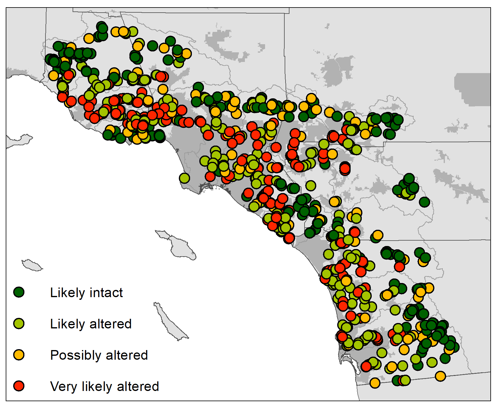

```{r, echo = F}
library(knitr)
opts_chunk$set(warning = FALSE, message = FALSE, fig.path = 'figs_pmmi/', dev.args = list(bg = 'transparent'))
```

```{r setup}
# libraries
library(tidyverse)
library(broom)
library(rgdal)
library(rgeos)
library(sp)
library(raster)
library(gridExtra)
library(micromap)
library(plotly)
source('R/funcs.R')

# data
data(allscr)
data(indat)
data(evdat)
data(sheds)
data(aldat)
data(ccdat)
data(sitcat)
data(sitein)

# color palettes
ctcol <- RColorBrewer::brewer.pal(3, 'RdYlGn') %>% 
  rev
tycol <- RColorBrewer::brewer.pal(9, 'PRGn') %>% 
  rev
ptcol <- RColorBrewer::brewer.pal(9, 'Set1')[c(1:3)]
```

### Reference site distributins

```{r psaref, fig.height = 3, fig.width = 6}
# get threshold cutoffs of reference sites scores, for the entire state
psascrs <- list.files('ignore', pattern = '^hybrid.*metrics.*\\.csv$', full.names = TRUE) %>% 
  read.csv(., stringsAsFactors = FALSE) %>% 
  rename(
    scr = Means, 
    SampleID = X
    ) %>%
  mutate(
    SampleID = gsub('\\.', '/', SampleID)
  ) %>% 
  filter(Type %in% 'ref') %>% 
  left_join(sitcat, by = 'SampleID') %>% 
  select(-cls) %>% 
  filter(!is.na(psa) & !psa %in% 'Central_Valley') %>% 
  mutate(
    psa = gsub('_', ' ', psa), 
    psa = gsub('Sierras', 'Sierra Nevada', psa)
    )
  
pthm <- theme(
    axis.title.x = element_blank(), 
    panel.border = element_blank(), 
    panel.grid.major = element_blank(),
    panel.grid.minor = element_blank()
  ) 

ggplot(psascrs, aes(x = psa, y = scr)) +
  geom_boxplot(fill = 'lightblue', width = 0.5) +
  geom_hline(yintercept = 0.78, linetype = 'dashed', col = 'red', size = 1) +
  theme_bw() + 
  pthm +
  scale_y_continuous('Index score') +
  theme(axis.title.x = element_blank())

```

```{r natgr, fig.height = 3, fig.width = 3}
# scores and natural gradients
scrsvnat <- list.files('ignore', pattern = '^hybrid.*metrics.*\\.csv$', full.names = TRUE) %>% 
  read.csv(., stringsAsFactors = FALSE) %>% 
  rename(
    scr = Means, 
    id = X
    ) %>%
  mutate(
    SampleID = gsub('\\.', '/', id)
  ) %>% 
  full_join(sitein, by = 'SampleID') %>% 
  select(SampleID, Type, scr, SITE_ELEV, AREA_SQKM) %>% 
  left_join(sitcat, by = 'SampleID') %>% 
  select(-cls) %>% 
  filter(!is.na(psa) & !psa %in% 'Central_Valley' & Type %in% 'ref') %>% 
  mutate(psa = gsub('_', ' ', psa))
  
# base theme
pbase <- theme_minimal() +
  theme(
    panel.border = element_rect(colour = 'black', fill = NA, size = 0.5),
    panel.grid.minor = element_blank(),
    panel.grid.major = element_blank(),
    legend.position = c(0.8, 0.85)
  )

p1 <- ggplot(scrsvnat, aes(x = AREA_SQKM, y = scr)) +
  geom_point(alpha = 0.7, size = 1.5) +
  geom_smooth(method = 'lm') +
  geom_hline(yintercept = 0.78, linetype = 'dashed', col = 'red', size = 1) +
  theme_bw() + 
  scale_y_continuous('Index score', expand = c(0, 0)) +
  scale_x_log10('Watershed area (square km)') +
  pbase
p1
```

### Map

```{r mapall, fig.height = 4, fig.width = 10}
# add shc shed names to fortified shapefile
key <- sheds@data %>% 
  rownames_to_column('id') %>% 
  dplyr::select(id, SMC_Name)
shd <- tidy(sheds) %>% 
  left_join(key, by = 'id')

# get threshold cutoffs of reference sites scores, for the entire state
thrsh <- list.files('ignore', pattern = '^hybrid.*metrics.*\\.csv$', full.names = TRUE) %>% 
  read.csv(., stringsAsFactors = FALSE) %>% 
  rename(
    scr = Means
    ) %>%
  filter(Type %in% 'ref') %>% 
  .$scr %>% 
  quantile(., c(0.01, 0.1, 0.3))

# scores with thresholds
toexp <- indat %>% 
  rename(`Index\ncategory` = scrcat) %>% 
  filter(ind %in% 'pMMI' & tax %in% 'Hybrid') %>% 
  mutate(scrcat = cut(scr, breaks = c(-Inf, thrsh, Inf), labels = c('Very likely altered', 'Likely altered', 'Possibly altered', 'Likely intact')))
# write.csv(toexp, file = 'ignore/cutoffdat.csv', row.names = F)
```


### Relationships with environmental variables

```{r fig.height = 3, fig.width = 5}
evvar <- list(
  varorg = c('Nitrogen_Total_mgPerL', 'SpecificConductivity_uSPercm', 'PCT_SAFN'), 
  varnew = c('Total Nitrogen (mg/L)', 'Conductivity (mS/cm)', '% Sand and Fines')
)

# new indices
toplo <- evdat[, c('id', evvar$varorg)] %>% 
  left_join(indat, ., by = 'id') %>% 
  rename(
    `Index Score` = scr
  ) %>% 
  .[, c('id', 'ind',  'tax', 'thr', 'Index Score', evvar$varorg)] %>% 
  filter(tax %in% 'Hybrid' & ind %in% 'pMMI')

# base theme
pbase <- theme_minimal() +
  theme(
    panel.border = element_rect(colour = 'black', fill = NA, size = 0.5),
    panel.grid.minor = element_blank(),
    panel.grid.major = element_blank(), 
    axis.title.y = element_blank(), 
    legend.position = c(0.8, 0.85)
  )

p1 <- ggplot(toplo, aes(x = Nitrogen_Total_mgPerL, y = `Index Score`)) +
  geom_point(alpha = 0.7, size = 1.5) +
  geom_smooth(method = 'lm') +
  geom_hline(aes(yintercept = thr), linetype = 'dashed', col = 'red', size = 1) +
  scale_colour_manual(values = ptcol) +
  scale_y_continuous(expand = c(0, 0)) +
  scale_x_log10('Total Nitrogen (mg/L)') +
  pbase

p2 <- ggplot(toplo, aes(x = PCT_SAFN, y = `Index Score`)) +
  geom_point(alpha = 0.7, size = 1.5) +
  geom_smooth(method = 'lm') +
  geom_hline(aes(yintercept = thr), linetype = 'dashed', col = 'red', size = 1) +
  scale_colour_manual(values = ptcol) +
  scale_y_continuous(expand = c(0, 0)) +
  scale_x_continuous('% Sand and Fines') +
  pbase

grid.arrange(p1, p2, ncol = 2, left = 'ASCI Score')

```

```{r, fig.height = 3, fig.width = 6}
evvar <- list(
  varorg = c('Phosphorus_as_P_mgPerL', 'Nitrogen_Total_mgPerL'), 
  varnew = c('Phosphorus (mg/L)', 'Total Nitrogen (mg/L)')
)

# combine index data, cram/csci data, and environmental data
toplo <- indat %>% 
  select(id, ind, tax, scr, thr, scrcat) %>% 
  inner_join(ccdat, ., by = 'id') %>% 
  inner_join(evdat[, c('id', evvar$varorg)], ., by = 'id') %>% 
  mutate(
    CSCI = cut(CSCI, breaks = c(-Inf, 0.79, Inf), labels = c('Lo', 'Hi'))
    ) %>% 
  unite('bug_alg', CSCI, scrcat, sep = ' / ') %>% 
  filter(tax %in% 'Hybrid' & ind %in% 'pMMI')

pthm <- theme(
    axis.title.x = element_blank(), 
    panel.border = element_blank(), 
    panel.grid.major = element_blank(),
    panel.grid.minor = element_blank()
  ) 

pcrm <- ggplot(toplo, aes(x = bug_alg, y = CRAM)) + 
  # geom_point(aes(y = CRAM), size = 2, alpha = 0.7) +
  geom_boxplot(fill = 'lightgrey') + 
  theme_bw() + 
  pthm +
  scale_y_continuous('Habitat condition') +
  theme(axis.title.x = element_blank())
pnut <- ggplot(toplo, aes(x = bug_alg, y = Nitrogen_Total_mgPerL)) + 
  # geom_point(aes(y = Nitrogen_Total_mgPerL), size = 2, alpha = 0.7) +
  geom_boxplot(fill = 'lightgrey') +
  theme_bw() + 
  pthm +
  scale_y_log10('Total Nitrogen (mg/l)')

grid.arrange(pnut, pcrm, ncol = 2, bottom = 'CSCI / ASCI score categories')
```

### Complements with CSCI

```{r clscmp, fig.height = 3, fig.width = 3}
thrsh <- data.frame(ind = c('ASCI', 'CSCI'), thr = c(0.78, 0.79), stringsAsFactors = F)

toplo <- indat %>% 
  select(id, ind, tax, scr, chcls) %>% 
  inner_join(ccdat, ., by = 'id') %>% 
  rename(ASCI = scr) %>% 
  filter(tax %in% 'Hybrid' & ind %in% 'pMMI' & chcls %in% c('Hardened')) %>% 
  mutate(chcls = factor(chcls, levels = c('Hardened'))) %>% 
  select(-ind, -tax, -CRAM) %>% 
  gather('ind', 'scr', -chcls, -id) %>% 
  na.omit %>% 
  left_join(thrsh, by = c('ind'))

ggplot(toplo, aes(x = chcls, y = scr)) +
  geom_boxplot(fill = 'lightgrey', width = 0.5) +
  facet_wrap(~ ind, strip.position = 'bottom') + 
  geom_hline(aes(yintercept = thr), linetype = 'dashed', col = 'red', size = 1) +
  scale_y_continuous('Index scores') +
  theme_bw() +
  theme(
    axis.title.x = element_blank(), 
    axis.text.x = element_blank(), 
    axis.ticks.x = element_blank(),
    panel.border = element_blank(), 
    strip.background = element_blank(),
    panel.grid.major = element_blank(),
    panel.grid.minor = element_blank()
  ) 
```

### Relationships with old indices

```{r oldcmp, fig.height = 3, fig.width = 3}
data(aldat)
data(indat)
data(evdat)

evvar <- list(
  varorg = c('Nitrogen_Total_mgPerL', 'Temperature_Deg_C'), 
  varnew = c('Total Nitrogen (mg/L)', 'Temperature (C)')
)

evdat <- evdat[, c('id', evvar$varorg)]

# base theme
pbase <- theme(
    panel.background = element_rect(fill = "white", colour = "white"),
    plot.background = element_rect(fill = "transparent", colour = NA),
    panel.border = element_rect(colour = 'black', fill = NA, size = 0.5),
    panel.grid.minor = element_blank(),
    panel.grid.major = element_blank(), 
    legend.title = element_blank(), 
    legend.position = 'none'
  )

xlab <- 'H20 Index Score'
lms <- c(0, 1.6)

# H20 threshold is 63.5, divided by reference median of 75, 0.85

toplo <- aldat[aldat$ind %in% 'H20', ] %>% 
  rename(cmp = scr) %>% 
  dplyr::select(-ind) %>% 
  left_join(indat, ., by = 'id') %>% 
  filter(tax %in% 'Hybrid' & ind %in% 'pMMI') %>% 
  left_join(evdat, by = 'id') %>% 
  mutate(scrdf = scr - cmp) %>% 
  filter(!is.na(scrdf)) %>% 
  filter(Temperature_Deg_C < 1000) %>% 
  mutate(
    cmpcat = ifelse(cmp > 0.85, 'Hi', 'Lo')
  ) %>% 
  unite('cmbcat', scrcat, cmpcat, sep = '/', remove = F) %>% 
  mutate(
    agrm = fct_collapse(cmbcat, Agreement = c('Hi/Hi', 'Lo/Lo'), Disagreement = c('Hi/Lo', 'Lo/Hi'))
  )
  
p1 <- ggplot(toplo, aes(x = cmp, y = scr, colour = agrm)) + 
  geom_point(alpha = 0.6, size = 1) +
  geom_abline(intercept = 0, slope = 1, linetype = 'dashed') +
  geom_hline(yintercept = 0.78, linetype = 'dashed', colour = 'red', size = 1) +
  geom_vline(xintercept = 0.85, linetype = 'dashed', colour = 'red', size = 1) +
  # geom_smooth(method = 'lm', se = T) +
  scale_colour_manual(values = ptcol[c(2, 1)]) +
  scale_y_continuous('ASCI Score', limits = lms) +
  scale_x_continuous('H20 Index score', limits = lms) +
  pbase
p1
```